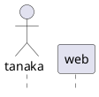

ドキュメントを書く際に使い勝手の良いMarkdown+PlantUMLの組み合わせですが、その環境をVSCodeのdevcontainerで構築します。

devcontainerを使うと同一環境を簡単に再現可能なので、ドキュメントごとGitで管理してしまえばチーム開発の際にとても便利です。

今回はその環境構築方法と、Markdown＋Plantumlの簡単な使い方を紹介します。

## 環境

- WSL2
- DockerDesctop

(Macでも当然いけます)

devcontainer自体の説明は[こちら](https://qiita.com/koinori/items/084a0770c1f9e72e0c14)が詳しいです。
予め利用できるように準備しておいてください。

## devcontainerの設定

ディレクトリを作成しVSCodeで開きます

```bash
mkdir document
code document # コマンドでVSCodeを起動できるようにPathを通してると便利です
```

以下の通りにファイルを配置し、VSCodeの一番左下の`><`の部分を押して`reopen in container`を選択するとdevcontainerが起動します。

```
document
├── .devcontainer
│   ├── devcontainer.json
│   └── docker-compose.yml
├── .vscode
│   └── setting.json
├── sample.md
└── sample2.md
```

.vscodeの部分は今回は省きますが、作っておくとVSCodeの設定を統一出来たりするので便利です。

### devcontainer.json

devcontainerの設定を記述する場所です。
`extensions`でRemoteContainer内で利用するVSCode拡張を指定でき、起動時に自動でインストールされた状態になります。
今回はPlantUMLを利用するのに必要なものと、後述する便利な拡張機能を含めています。

```json
{
  "name": "document container",
  "dockerComposeFile": "docker-compose.yml",
  "service": "document",
  "workspaceFolder": "/workspace/",
  "extensions": [
    "jebbs.plantuml",
    "shd101wyy.markdown-preview-enhanced",
    "yzhang.markdown-all-in-one",
    "csholmq.excel-to-markdown-table",
    "DavidAnson.vscode-markdownlint"
  ]
}
```

### docker-compose.yml

Dockerのimageはplantumlの公式が用意しているものを利用できます。

```yml
version: '3'
services:
  document:
    image: plantuml/plantuml-server
    container_name: plantuml-container
    volumes:
      - ..:/workspace
```

## PlantUML+Markdownの書き方紹介

PlantUMLでは様々な図を描画することが出来ます。
また、図の一部を別ファイルに定義し、それをincludeする事も可能です。
簡単なサンプルをここに記載しますが、詳細は[公式サイト](https://plantuml.com/ja/sitemap)を参照してください。

### sample.md

````markdown
# サンプル

PlantUMLでの描画サンプルです

## アクティビティ図

```plantuml
@startuml
start
:サンプル;
if (分岐) then(no)
else(yes)
    !include ./sample2.md!sample
endif
end
@enduml
```

## シーケンス図

```plantuml
@startuml
!include ./sample2.md!sequence_header
t -> w: 表示してほしい
!include ./sample2.md!consider
w -> t: 表示してあげる
@enduml
```

````

### sample2.md

````markdown
# サンプル2

## アクティビティ図


## シーケンス図

シーケンス図のヘッダ部分の共通化も出来ます



共通ヘッダを用いて記述が出来ます

```plantuml
@startuml (id=consider)
!include sample2.md!sequence_header
group
w -> w: 悩む
note right
    別ファイルに色々定義できます
endnote
end
@enduml
```

````

### sample.mdのプレビュー

上記2ファイルを定義した上でsample.mdをプレビューすると以下のようになります。


ちゃんとMarkdownのプレビュー中にPlantUMLの図が描画されている事がわかります。

## VSCode拡張機能の紹介

最後にこの環境を利用する上で使う上で必要だったり、あると便利だったりするVSCodeの拡張機能を紹介します。
最初に書きましたが`devcontainer.json`に記載することでdevcontainer立ち上げ時に最初から拡張機能がインストールされた状態になりますので、他にも便利なものを見つけたら追加していくと良いです。

### 必須なやつら

- PlantUML
- Markdown Preview Enhanced

MarkdownとPlantUMLを組み合わせて使うのに必要な拡張機能です。
Markdown Preview EnhancedはPlantUMLだけでなく様々なプレビューを表示可能です。

### あったらいいな

必須ではないけれど、あると便利な拡張機能です。

#### Excel to Markdown table

個人的にMarkdownで資料を作るとき一番面倒なのが表作成なのですが、この拡張機能はExcelから表をコピーし、Markdown形式で貼り付ける事を可能にする事でそれを解決できます。
表作成だけExcelかGoogleSpreadSheetで行えば良いのでとても楽です。

#### Markdown All in One

各種ショートカットを利用出来たり、勝手に更新されてくれる目次を作れたりとかなり便利です。
他にも色々機能があり、私はまだ一部しか使いこなせてません。
詳細は[公式リポジトリ](https://github.com/yzhang-gh/vscode-markdown)を参照してください。

#### markdownlint

その名の通りMarkdownのlinterです。
設定により細かくルールをカスタマイズできるのでお好みでどうぞ。
細かい事は[公式リポジトリ](https://github.com/DavidAnson/markdownlint)からどうぞ。

### devcontainer.jsonへの拡張機能の追加

手書きで設定ファイルに追加しても良いのですが、以下のようにマーケットプレイスから簡単に設定ファイルへの追加が出来ます。
その際、devcontainer起動中だと上手く追加が出来ないので一度ローカルで開きなおしてから行ってください。


