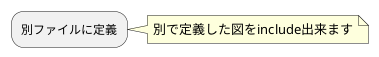
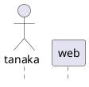

# サンプル2

## アクティビティ図



## シーケンス図

シーケンス図のヘッダ部分の共通化も出来ます



共通ヘッダを用いて記述が出来ます

```plantuml
@startuml (id=consider)
!include sample2.md!sequence_header
group
w -> w: 悩む
note right
    別ファイルに色々定義できます
endnote
end
@enduml
```